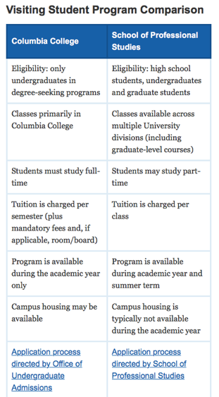
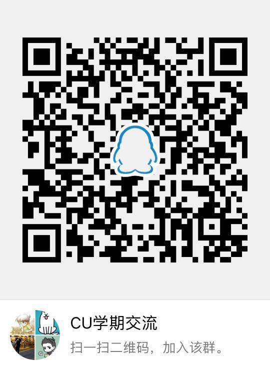

# 哥伦比亚大学学期交流攻略 

### 写在前面：

大家好，我是来自致诚书院2016级统计系的阳宗灏。在大二自主申请并拿到了哥伦比亚大学、宾夕法尼亚大学和天普大学的学期交流的邀请，在申请的过程中积累了一定的经验。利用暑期的时间，完成了这样一份攻略，主要针对哥伦比亚大学学期交流的申请，当然学期交流的申请都大同小异，对于申请其他项目的南科大同学来讲也有一定的借鉴意义。在整个攻略的完成过程中，我想要特别感谢与我合作的2016级金融科技专业唐龙飞同学，帮我完成了中介部分的内容，并对整文的修改、内容的充实做了非常多的工作，还要感谢李浩然学长和杨瑞雪学姐对攻略提出的修改和添加建议。最后通过我们大家的努力，终于为大家呈现出了这部非常全面，涵盖项目申请，奖学金申请以及出国准备事项的攻略。我想借此攻略为我的交流申请季做一个总结，希望能够对将来申请的同学提供一些指导，同时我想向在我申请过程中帮助很大的韩蔚老师表示感谢！

在本文中，涉及到一些学校政策，和招生政策层面的内容，若有改变和错误之处欢迎同学们指正。 

### 项目介绍：

哥伦比亚大学的学期交流项目众多，大致分为三类：学分项目（TOEFL100+）、语言项目（TOEFL85-99）、商科证书课程（TOEFL85-99），学业合格可获得商科专业证书Certificate of Professional Accomplishment。

学分项目是学生们选择的主要项目，一学期的费用总计会在25-30万人民币左右。由三个学院分别招生：Columbia College（cc），School of Engineering and Applied Science（seas），以及School of Professional Studies（sps）。cc和seas是哥大最大两个本科生学院，如果你是学工科的同学，申请的时候请申请seas的学期交流。其他学科的同学就可以申请cc。以上至于cc和sps两个学院，我在这里可以给大家详细讲一下，因为在申请的时候还花时间做了一些research。首先，我先放一张官网上的对比图（图一）。

​                                                                          图一

其实这两个院最大的区别在于cc是本科生院，而sps是研究生院。在选课的时候，cc的访学生如果想要选研究生课程需要得到advisor的approval，但是sps的同学在这方面就不受限制，而且sps同学的选课优先级要高一些，sps的同学比cc的同学先选课。但是对于各个具体的课程来说，有的会只对cc学生开放，有的只对sps学生开放。虽然也能cross register到不对你学院开放的课程，但是比较痛苦和麻烦。所以建议大家可以先在Vergil系统查到自己想修的课程是对哪个学院开放，再决定申报哪个项目。

还有一点区别就是cc会在春季学期提供宿舍，而sps不提供学生宿舍。就在哥大就读的体验来讲，其实这两个学院提供的交流项目没有太大的区别，只是最后的成绩单一个是cc给的，一个是sps给的。至于同学们最后选择哪个项目还是你们自己的决定，不过有一点要提醒的是cc的申请一般在3月就会截止（秋季学期交流），而sps一直到6、7月都还可以申请，所以如果错过了cc申请的同学还有机会申请sps的交流项目。对于南科大来讲，不管是哪个项目都会提供奖学金的，所以大家不必担心。因为我本人是申请的cc，所以本文我将着重介绍cc的申请。

### 申请准备：

1. 语言考试：作为学期交流的申请，语言考试都是必不可少的。哥大的学期交流的语言成绩要求是：TOEFL：100+（、IELTS：7.0+）哥大需要ETS把官方成绩单直接寄到哥大（学校代码: 2116），所以在注册托福考试的时候一定要记得勾选把成绩单寄到哥大，补寄还是有点小贵的，所以珍惜免费邮寄的机会。语言成绩是硬门槛，过了这个分数线被录取的概率就会提高很多。当然分数是越高越好，如果在准备学期交流的时候就拿到托福110+的话，在两年有效期内研究生申请还能接着用。这里我提供4位南科大被此项目录取的同学的TOEFL成绩：同学A – 104分；同学B- 106分；同学C- 101分：同学D-99分。另一方面需要非常注意的是考试准备的时间节点。我的建议是假设你是准备大三的秋季学期入学（申请截止时间为入学同年4月左右），那么你最好大一的暑假就开始准备托福并在暑假结束时考一次，如果考过了100分，那么就恭喜你，暂时摆脱语言考试。如果没有考过的话（in most cases），不用慌张，你还有大二寒假的时间来准备托福考试，但这一次就是背水一战，最后一次了。

2. Letter of eligibility: 哥大学期交流的申请需要教授或教工部的老师写一个letter of eligibility来证明你在学习优秀，人品正直。大家可以找自己的书院导师来书写。官网的原文是这样的：

*A signed Statement of Eligibility from the applicant’s academic advisor or an equivalent official (such as university registrar) who verify that an applicant is enrolled full-time; confirm that the applicant is in good academic and civic standing at his or her university/college; and verify that the applicant is permitted to study elsewhere as part of the Visiting Student Program. This statement should not be a letter of recommendation from an instructor.*

3. 推荐信：申请还需要由你的数学或其他理科教授提供一封推荐信。其实在我今年的申请中是不需要推荐信，这是新加的要求。官网上的原文是：

A letter of recommendation from a professor in a math or science class.

4. Short Questions: 哥大学期交流的申请不需要personal statement（PS），取而代之的是三个short questions，每个问题的回答不超过250个词。这里我把我申请时回答的三个问题贴在这里供大家参考。

*a)*    *Why do you seek to spend a semester at another institution? What do you hope to gain from a visiting students experience?*

*b)*    *What do you value most about Columbia and why?*

*c)*    *Why do you wish to pursue the courses you have indicated at Columbia?*

这三个短问题一定要非常重视，其作用和PS的作用相同，当大家的语言成绩和GPA都过线的时候，招生官做筛选的时候就是通过这三个短问题来挑选更适合哥大，更明确哥大的学期交流作用的学生。这里，我的建议是大家最好在申请通道开通后就尽早去官网看看是什么问题，放在脑子里好好思考一下，写一个初稿。大家别忘了，英语老师和语言中心都是准备英语文书很好的资源。写好的回答一定至少要给一个native English teacher看一下，他们会给你很好的修改意见。语言中心每学期也提供了写作的tutorial，大家可以好好的利用这些资源。

### 申请流程(以秋季入学为例)

 图二

这里我以秋季入学为例，做了一个大概的申请流程图（图二）。当然这只是我的建议，错过了以上的时间节点并不一定代表不能申请了，大家只要做到plan ahead就可以。首先最先准备的是语言考试，具体时间我在上一个部分做了详细的解释，请一定记得邮寄ETS的官方成绩单给哥大。第二个需要注意的时间节点是申请开始的时间，一般在入学前一年的十二月份左右，官网上会提前告知，大家可以留意一下。当申请通道开通以后，同学们就可以开始申请了，填写个人资料，上传成绩单等等。这个时候你就可以看到申请时要求回答的三个短问题了（不知道每年会不会有改变）。然后按部就班的准备短问题，要推荐信、letter of eligibility等等就可以了。还有就是申请截止日期，即使你的语言成绩还没有过，都一定要在截止日期前提交申请，要不然就错过啦。最后就congratulations啦，收获offer。

### 奖学金申请

那么在获得offer以后要做的一件非常重要的事情就是申请奖学金啦，我们非常幸运南科大为本科生提供了如此丰厚的奖学金。目前，我们可以申请的奖学金主要有两个：南科大卓越计划和留学基金委员会（留基委）优秀本科生资助。

首先卓越计划的奖学金是每学期小于等于20万或不超过项目所需费用的100%，由土豪爸爸南科大提供，只需要申请者GPA超过3.5，交流学校为以当年us news为参考全球排名前二十的院校即可。政策一直在变，请同学要提前咨询一下国合部和教工部的老师。当然哥大是满足要求的，所以只要你GPA过了3.5就可以申请。但如果你的GPA低于3.5，又被哥大录取了的话，你还可以申请南科大对长期项目的资助不超过6.5万元。南科大的资助申请时间一般在交流上一个学期的学期末。

另外就是留基委的资助，我们学校的名额只有1个，不过按照经验学校会超额推荐，所以建议大家都试着去申请一下留基委的资助，即使不是学校推荐的第一顺位，还是有机会通过审核获得资助的，我就是一个幸运的案例。留基委的资助内容是：往返旅费，签证费和补贴生活费1600美元/月（纽约州）。留基委的奖学金需要非常注意的是他每次秋季学期的申请时间大概在4月底到5月初，且非常严格，过时不候，比较尴尬的是哥大的offer一般是在5月份才发放，所以大家最好尽早提交哥大的申请，然后到了三月份就开始发邮件向哥大说明你的情况，催他们尽快审核你的申请，赶紧发offer。

同学们，这都是真金白银呀，收到offer就抓紧时间申请吧。 

### 后续事项

同学们，当你拿到offer以后，还有很多很多的事情等着要完成。这里我给大家简单的列举一下。

* 申请奖学金：南科大的奖学金申请相对容易，只需要按照教工部和国合部的要求提交材料即可，所以不多说。留基委需要准备的资料是非常繁琐的，没有什么捷径可走，大家按照要求提供资料。再提醒一下，申请期限很重要，一定不要错过了。因为上面已经作了一些说明，这里就不重复了。

  对于想要在哥大交流两个学期的同学，我想再和大家分享一个留基委申请的头疼事。哥大的学期交流项目是一到两个学期，有的同学如果想在哥大交流两个学期的话，在留基委的申请上会遇到一些麻烦。哥大在发邀请信的时候只会发第一个学期的offer，即使你明确了第二个学期要在哥大就读，哥大也只会在第一个学期结束前才问你是否愿意第二个学期继续就读。这时如果你选择继续就读，哥大才会发放第二个学期的offer。为什么说这个会造成麻烦呢？我们在申请留基委的奖学金的时候，由于标准化审核的需要，留基委要求资助的期限要严格按照录取信的学习期限发放，且同一阶段（即本科），不能二次申请。也就是说大家最多只能申请到留基委4个月的生活费资助。而且，如果要在哥大就读两个学期的话，第一个学期后需要先回国报道，然后再出去交流。如果中途不想回国也可以，毕竟寒假只有半个多月的时间，倒两次时差就差不多了，那就需要办理延期回国的手续，否则会按照违约处理。那么，如果有同学遇到了这种情况，我的建议是：积极和哥大交涉，电话和邮件都用上，说明自己的情况，尽量能争取到两个学期的offer，或者是conditional offer也可以（说明如果第一学期期末考试全部通过的话将允许你继续就读），在邀请信上明确标明两个学期的留学期限。虽然我今年没有成功，但是说不定申请的同学口才比我好就说动了哥大的职员了呢。

* 办理护照和美国签证：这两样东西是必不可少的，尤其是申请留基委的同学，尽早办好可以提前预定机票，这样更可能选到自己心仪的航班。护照和签证呢，不是留基委统一办理的，需要大家自己去办理。其中，签证费可凭借中信银行的收据报销（留基委），所以大家可以放心大胆地去自己办理签证。

* 租房：哥大对于学期交流的同学只在春季学期提供宿舍，秋季学期不提供宿舍，所以秋季入学的同学需要自己在校外找房。学校宿舍的租金大约在1100美元/月左右，根据位置和房型不同而变化。校外的住宿价格在1000到1600美元/月之间，当然纽约也有很多luxury building，租金在2000+。哥大的校园主要集中在114街到122街之间，125街以北黑人就会逐渐增多，因此从安全的角度来讲建议大家租房尽量选在125街以南的街区。预算较少的同学还可以租住客厅，价格一般在1000美元/月以内。这里，我为大家总结一下住房的途径：

  * UAH：http://facilities.columbia.edu/housing/overview UAH住房是指学校的房屋住宿系统，房源主要集中在Morningside campus附近、Medical Center附近以及Bronx附近（Arbor）。 房间类型主要分为两种：apartment和dormitory。 Apartment一般是指两室一厅或三室一厅的公寓房，一般带有一个厨房、一个卫生间以及一个客厅。整栋楼一楼可能会有doorman，但是大多数是没有的。 Dormitory是指一间较大的房屋内具有相对独立的约10个左右的房间，房间大小根据房型结构不同而不同，dorm一般配有一个公用的厨房和两到三个公用的卫生间，定期会有人进行公共部分的打扫，楼下都有doorman。Dorm的房间可能是单人间，也可能是双人间，个人根据不同情况选租。 另外一种UAH的宿舍类型是studio，较为适合携带配偶的学生居住，但申请时需提供相应法律关系证明。 

  * I-House (International House) https://www.ihouse-nyc.org/ 一个连锁的独立公寓机构，开放给各类学生和实习生，提供短住和长住。I-House是独立于哥大的系统，所以其申请也可以不受制于学院审核。它位于Riverside Drive &W122nd Street，临着两个公园，其中很多房间可以看到Hudson River的河景。旁边是大教堂和曼哈顿音乐学院。步行10分钟即可到达哥大。I-House里社区的氛围非常浓，经常都会给国际学生举行一些文化交流活动。但是申请相对比较困难，有的需要提交你的个人陈述，并且由居住在house里的同学组成的委员会来审核。若能够入住I-House也一定是一个非常不错的经历。如果已经申请成功并接受了I-House的房子，在到达的当天就可以入住。 

* OCHA (Off-Campus Housing Assistant) https://ocha.facilities.columbia.edu/registration/index OCHA系统是哥大为学生们于曼哈顿地区搜索校外住宿时所提供的帮助。由于这是学校官方整理的信息，这个数据库比其它网上的找房系统更为可信。只需要把你的UNI输入即可登陆。透过这个数据库，那些没有申请到学校宿舍以及想住校外的同学可以找到直接联系长租或短租的室友，并可以设立自己的资料页面寻找一起合租的小伙伴。那些已经找到住房但需要多一个或几个室友的同学也可以在这里找到可信赖的未来室友。 

* 微信群：每年哥大的中国新生都会建立很多的微信群，这些群里会有很多租房，转租和合租的信息，是在校外租房最常用的一种方式。

  因为哥大的学期交流项目（cc）在秋季学期是不提供住宿的，所以秋季交流的同学都会面对校外找房的问题。主要就是通过OCHA和微信群两个渠道找租房。因为是校外找房，所以大家一定要事前甄别好，安全始终要放在第一位。校外的房源租期普遍都是一年，租期为一个学期的房源非常少，对于只交流一个学期的同学来说租房是一个难题。春季学期的同学可以直接住学生宿舍，秋季学期的同学就只有耐心地等一个学期的房源，经常关注OCHA的网站。找房是一个长线的工作，大家从5月开始就可以关注着，如果有好房源就下手，不过哥大附近的房源非常多，等到暑期的时候再看也是没有问题的。这里我再贴一个纽约犯罪地图，大家可以在租房的时候做参考。

* NYPD纽约市犯罪地图：https://maps.nyc.gov/crime/ 

* 办理南科大的离校手续：大家可以在暑假的时候完成这个事情，具体的要求请参照教工部和国际部的邮件指导。

* 办理电话卡：首先要注明一点，在美国这边打电话发短信都是免费的，套餐费用主要决定了高速流量的多少。在国内国外都可以办理电话卡，国内的话中国电信美洲分公司比较常用，plan大概在25~50刀不等，好处是可以在国内拿到电话卡，一下飞机就能用。美国本土的运营商很多，我推荐AT&T，个人plan大概在30~50刀不等，如果加入family plan会更复杂一些，可以到了这边再了解。在美办电话卡的好处是信号更强，营业网点很多，客服方便，还会有协约机优惠，不过需要自己到了纽约之后来办，刚到美国的第一天可能不太方便。最后还有一点，就是在美国携号转网和换套餐很方便，所以如果对自己目前的运营商不满意，随时可以去营业网点换。如果觉得最开始两三天不方便，国内移动漫游过来一天30人民币max不限流量，可以这样cover没办美国号码的那几天。

  我自己是订的中国电信美洲公司的电话卡，码了这么长的文章也给自己插入个广告，哈哈。大家在订购电信卡的时候，欢迎使用我的推荐码：YCFI，输入后双方都能获得十美元话费。

* 银行卡：银行卡有多种选择。国内办的话，比较推荐中国银行的“美好前程”留学开学服务，综合来看比较实惠的。同学们也可到了美国以后再办理银行卡，因为国际银行卡盗刷的情况在国外比较难预防和处理，而且卡片出现什么问题，如丢失，也很难处理，所以比较推荐大家到了美国之后自己办一张当地银行卡。

其他的可能还有选课，orientation，交学费之类的问题，我就不在这里说啦。哥大要求国际学生都要购买保险，且不能通过其他保险waive。目前哥大有两个保险的plan：90 plan和100 plan，里面的保险内容和额度都不同，价钱也不同，大家可以自己选择。因为哥大的体系已经非常成熟，在开学前，会一步步的有邮件来引导大家做到哥大前的准备，非常的详细，大家不用担心。 

### 中介V.S.DIY

DIY的过程在上文中已经说的比较清楚了，因为也有同学是通过中介的方式申请到了哥大的学期交流项目，这里单独说一下。具我了解，在至今所有成功申请到哥大交流项目的六位同学中，有四位是通过中介申请的。

首先，中介收取的费用是在1万人民币左右。仅仅是提供项目管理以及一些在美生活、学习方面的帮助，不会帮助修改personal statement等会影响录取的文件，因此可以认为通过中介并不会提高被录取的概率。下面我会列举中介和DIY的不同之处。

a)    在申请前期，不需要教授或者学校的推荐信。提交的也不是上文提到的三小问，而是需要提交一篇personal statement。这和申研时的ps已经很像了，所以以后有出国读研打算的同学们可以先拿这个练练手。需要注意的，国人与老美在进行这种写作的时候思维差异还是很大的，大家自己写的第一份ps在老美看来肯能是千篇一律，毫无重点，所以强烈建议同学们寻找一位语言中心的native speaker，从一开始就帮助自己构建思路，再一遍遍的修改。（我当时花半个多月润色的ps再拿给外教看后被痛批一顿，只得推倒重来，又花了两三周的时间才最终定稿）

b)    中介也会先进行一遍电话面试，筛选出一部分同学（我私下了解到，中介在电话面试中大概会滤掉50%的人）

c)    在申请中，中介是和哥大直接对接的人，同学们只用按照中介的指导一步步进行即可。对于学业繁忙的同学还是能节省大量的时间的。

d)    纽约附近的租房时，一般都是要求一签一年的合同，对于想念一个学期的同学来说，找到适合的半年房源是极其困难的（笔者关注了一两个月也还是没有找到。。。）通过中介的话，会提前在合作的公寓中帮同学们留好房间，租期也是刚好吻合同学们的项目时间。这一点还是提供了比较大的方便的。

e)    中介会让参加同一个项目的同学组成小组，在美国后每周都要上交访学报告以及互相交流、帮助，还是有助于同学们尽快适应美国生活的。在行前也会举办交流会，请到往届同学分享经验等。

f)    对于想考雅思的同学，中介和雅思有一个合作的奖学金。在同学们项目结束回国后，可以递交访学报告进行评比，最高可以获得2万人民币的奖学金。

g)    中介还有一些附赠的服务，比如到美之后的接机，额外的医疗保险等。 

中介提供的服务大致就是这些，主要还是能帮助同学们避开一些坑以及

同学们和哥大交流中的障碍。大家可以自己考虑花费1万人民币来购买这些服务还是DIY。

### FAQ

其实并没有什么问题，只是自己脑补了一些同学们可能关心的问题在这里做一下解答。

a)    在哥大学期交流后可不可以留在纽约实习？

纽约是全球金融的中心，这也是很多选择来哥大进行学期交流的同学的一个关键的原因。但是答案恐怕会让大家失望了，对于学期交流的同学来讲是不可以在交流结束后的暑期或者寒假实习的。在美实习工作是需要拥有实习签证的，美国的实习签证分为OPT(Optional Practical Training)和CPT(Curriculum Practical Training)签证。OPT签证是持F-1学生签的同学最常申请的实习签证；CPT签证是如果课程中包含实习要求，才申请的签证。但是对于交流的同学来讲，因为visiting student program是一个non-degree program，所以不符合申请OPT和CPT的要求。因此，在交流后是不能留在美国实习的。

b)    春季学期交流还是秋季学期交流，或者交流一个学年？

对于交流一个学期的同学，我的推荐是在秋季学期交流。如果在春季学期交流会涉及到在南科大的期末考试缓考的问题，因为哥大的春季学期一般在一月初到五月底，正好和南科大秋季学期的期末时间重合。那么关于是否交流一个学年的问题，第一个要考虑的是自身的经济情况，因为奖学金基本可以覆盖第一个学期的费用，但是第二个学期的费用基本是自己负担的。其次交流一个学年也是有利有弊，利在于在哥大的体验更加完整和充分，甚至还可以利用一年的时间在哥大有自己的实验课题；弊则在于交流的这一年往往会占用你整个大二或着大三的时间，这样的话会间断南科大的培养，导致不能专心于需要连续时间投入的实验课题。

c)    学分认证问题：

南科大对学分的互换非常开放，同学们在申请学分换算的时候，需要在南科大官网中下载学分认定表，最后在交流结束后将填好的表格交至教工部即可。在确定需要认证学分的课程后，需要向哥大教这门的老师或系秘书发邮件要课程的syllabus，拿着syllabus给南科大教这门课的老师看，若课程内容能够基本覆盖的话，请教授在表格上签上字，只要大家在交流的时候通过了这门课，学分就可以认证。

九、资金准备：

哥大交流整体下来花费还是比较大的，而且学校的资助也是在同学们回国之后再审核、资助，另外申请签证时也需要有30万左右的存款证明，所以资金的筹集也是一个比较重大的问题。我会按照时间先后，依次说明一下每一个阶段需要准备的资金。

a)    申请时：申请费邮寄费等折合成成人民币在2000元左右，此时不需要太多的资金准备。

b)    收到offer后：可以开始申请I-20表格，用于申请签证。此时需要提交28万元的存款证明，冻结资金至拿到美签。存款证明文件的目的是向哥大证明学生所在的家庭有足够的经济能力承担学生在美期间的学习和生活费，以及向签证官证明学生去美国的目的就是学习。存款证明文件可以不用新开账户；几个账户分别开存款证明也可以，只要总额达到要求。最后，同学们在获得签证后即可解冻，不会影响到后续交学费交房租等事项。

c)    房租：如果是租房的同学，最开始订房前会交一笔定金，通常是一个月房租，在1万人民币左右。房租根据租约的不同，有月付，一次性付半年等付租金的方式，同学们此时则需要根据自己的具体情况付租金。

d)    学费：学费是在开学之后才缴纳，有一次性付清，月付等不同plan，同学们可以根据自己的情况考虑。

### 交流感受：

这里，我主要想谈一谈我的感受。主要有三点：第一是提升了自己的生活和语言能力；第二是认识了很多优秀的同学；第三是在一天天的挑战中成长。

刚到美国后最大的感受就是我人生第一次自己独立的过生活。来之前需要租好房，来了以后需要给自己添置家具，每天还需要为吃什么发愁，每次买个东西还非要把价格换成人民币让自己好好心疼一下….这里没有了国内的食堂，两步就可以吃到自己习惯的食物，上课也不再是从宿舍到教学楼的距离。当我突然有一天需要面对这一切的时候，我深刻地感受到了，这才是生活。生活本就不是永远安逸，留学让我们提前接触到了生活茶米油盐的一面。我慢慢的开始不再依赖路边的餐车，经常去超市里买菜，自己回家做。每次听着电台，做着饭，也不失是一种愉快的体验。当然，出国还有一个必须面对的问题是语言，在面对外国人的时候，迫使自己只能用英文交流。我自己呢，因为从初中开始就在外国语学校，所以一直以来对英语交流都非常的感兴趣，所以在这样的环境下，我生活的更加的自如。在一年的学习生活里，我不知道我的英语口语和听力是否有提高，但是我确定的是我在和外国人交流的时候更加的自信了。这是我的第一点收获，也是最实际的收获。

通过在哥大这样世界顶尖的学府交流的机会，我认识了许多身边优秀的同学。他们中有来自哥大的本科生和研究生，也有同样来交流的来自中国其他高校的同学们。我们在课上课下的交流中，增进了友谊。我认为这些友谊是我可以从哥大带走的东西，他们会在往后的日子里，在我需要帮助的时候随时站在我的身后。举一个小例子吧，我作为来自中国的同学，答题解题的能力相对更强，所以我经常在课下和同学一起讨论作业的时候充当了梳理概念，讲解习题的角色，这让我认识了一个在之后对我有很大帮助的朋友，Kevin。在暑假快要到的时候，他问我我找到暑期实习了吗？我说还没有。然后他就offer给我了一个实习的机会，让我非常感动。而且在那之后，他还专门花了一下午的时间帮我修改我的CV和Cover Letter。我当时就坐在那里，看着两个native speaker一字一句的抠我的简历的时候，我走神了，我感觉我为何如此幸运。在这一年的时间里，我身边发生了太多这样的事情，我真诚的为他人给予了帮助的同时，我收获了真挚的友谊。

最后一点收获也是最深刻的，就是在哥大每天都有不同的挑战，让我在挑战中不断的成长。不可否认的是在哥大这样的学府学习的学生都是这个时代的佼佼者，他们有着优异的学习成绩，同时也在其他方面有着亮眼的成就。在哥大，从课程本身的难度，领域泰斗的教授，到身边优秀的同学，他们每一天都在挑战和激励着我。在这样的挑战中，我承认我有过沮丧，认为自己不够优秀，永远无法达到他们的高度。但是，在我熬过这个沮丧之后，我成长了。我开始去追问自己在人生的维度上到底想要什么？我不再把参考系放在他人身上，而是我自己，关注自己的成长，这样的转变让我更加的从容，自信。

综上是我总结的留学一年来的感悟。希望对之后的同学们有一个参考和启迪的作用。我非常感恩在哥大的这一年，感恩这次经历给我带来的一切。我也感谢南科大给我了这样一个机会让我可以在哥大学习。在这一年，我收获了，成长了，交到了真挚的朋友，我认为这就足够了。

### 联系方式：

欢迎大家加入哥伦比亚大学学期交流qq群，大家有什么疑问都可以在这里讨论。

有问题需要单独探讨也可以联系我的个人邮箱：yangzh98@qq.com

 

相关链接：

* 哥伦比亚大学学习交流项目：http://undergrad.admissions.columbia.edu/apply/visiting-students

* Virgil系统：https://vergil.registrar.columbia.edu/#/courses/*
* 中国银行“美好前程”信用卡：http://www.boc.cn/pbservice/pb4/200811/t20081120_14095.html

* 学分认证表格：http://www.sustc.edu.cn/communication_down

 

 

 

 